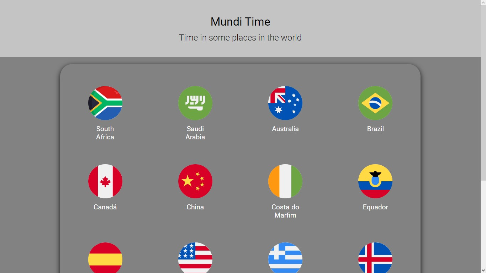
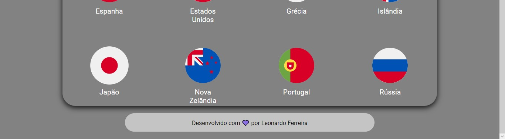

# Mundi time

# Screenshots

# The Project

This is a project to show the time in some places in the Earth,
currently I only made the style of the page, after I'll apply funcionality to this project.

# Why i made this
This is a personal project to get a large knowledge about
new technologies that I don't use often, I believe that
we can learn more with this way. 

# Technologies

<a href="#">

&nbsp;

&nbsp;

&nbsp;

&nbsp;

</a>

# How to use

<h3>To use this project install the dependencies in your integrated
terminal using the command: **npm install** or if you use yarn
just type **yarn**, this project is running on port localhost:3000. If you want to contribute to this project do a fork and a PR to help me. I will often make commits of any changes, see ya.</h3>

# Developed with 💜 by Leonardo Ferreira